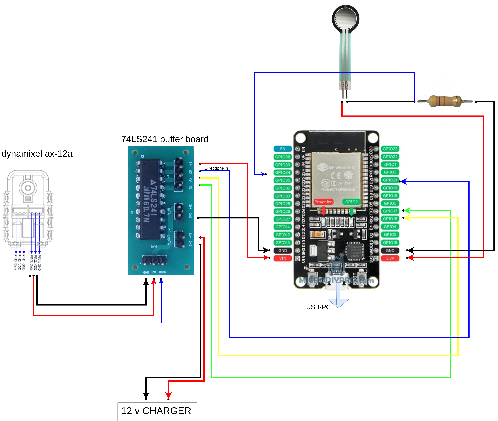

# IW2026 QS — Force-Sensitive Robotic Gripper

This repository is dedicated to **Quick Success (QS)** during the **Innovation Workshop 2026** at Skoltech, Moscow, presented by the **ISR Lab** team.

The project builds a **vision-guided, force-sensitive robotic gripper**: students assemble and program a gripper built on an ESP32, a Dynamixel AX-12A servo, and a force-sensitive resistor (FSR), then control it using hand-gesture recognition through a webcam. The repository stays as a living resource for future Skoltech Innovation Workshops.

> **Vision understands the object, the human provides the intention, and force sensing keeps the grasp safe.**

---

## Repository Structure

```
├── Images/                          → wiring/circuit diagram
├── examples/                        → Arduino test sketches (motor, FSR, Bluetooth)
├── AX-12A-servo-library-master.zip  → Arduino library for the Dynamixel AX-12A
├── code/                            → computer-vision layer (MediaPipe, YOLOE, emotion bonus)
├── LICENSE
└── README.md
```

---

## 1. Hardware Components

| Component | Role | Where to find it |
|---|---|---|
| ESP32-WROOM-32 dev board | Main microcontroller, USB-powered from PC | [Espressif product page](https://www.espressif.com/en/products/socs/esp32) |
| Dynamixel AX-12A servo | Actuates the gripper jaws | [Robotis AX-12A datasheet](https://emanual.robotis.com/docs/en/dxl/ax/ax-12a/) |
| 74LS241 half-duplex buffer board | Converts ESP32 TTL serial ↔ Dynamixel half-duplex bus | Logic supply from ESP32 VIN/USB 5V rail |
| FSR (force-sensitive resistor) + 47 kΩ resistor | Measures grasp force, pull-down configuration | Junction read on GPIO34 (ADC1) |
| 12V power supply | Powers the servo only (via buffer board V_IN) | — |
| 3D-printed gripper jaws | End-effector | STL files (add link if hosted) |

---

## 2. Wiring / Circuit Diagram



Confirmed wiring:

- `TX2` (GPIO17) → buffer board RX
- `RX2` (GPIO16) → buffer board TX
- `DirectionPin` → GPIO21 (`#define DirectionPin (21u)`)
- FSR: `3.3V → FSR → junction → 47kΩ → GND`, junction read on GPIO34 (higher force = higher `analogRead()` value)
- All grounds tied together; **12V only powers the servo**, never the ESP32 logic

Confirm every connection with a multimeter before powering the board.

---

## 3. Software Setup

### Arduino IDE

Download and install the Arduino IDE:
👉 https://www.arduino.cc/en/software

### ESP32 board support

Add the ESP32 board package following this guide:
👉 https://randomnerdtutorials.com/installing-the-esp32-board-in-arduino-ide-windows-instructions/

> ❗ Install **board package version 1.0.6** — newer 3.x versions can break compatibility with the AX-12A library.

### USB driver

| OS | What to do |
|---|---|
| **Windows** | Install the driver matching your board's USB chip before it will appear as a COM port: [CP210x driver](https://www.silabs.com/developers/usb-to-uart-bridge-vcp-drivers) or search "CH340 driver windows" depending on which chip is on your board (check the small chip near the USB port, or Device Manager → *Other devices*). |
| **Linux (Ubuntu)** | No driver install needed — CP210x/CH340 support is built into the kernel. Just run `sudo usermod -a -G dialout $USER`, then log out and back in so your user can access `/dev/ttyUSB0`. |

### AX-12A servo library

1. Download `AX-12A-servo-library-master.zip` from this repository.
2. In Arduino IDE: **Sketch → Include Library → Add .ZIP Library…** and select the downloaded file.
3. Restart the Arduino IDE if the library doesn't show up immediately under **File → Examples**.

---

## 4. Example Sketches (`examples/`)

Test each stage independently before combining them — this makes it much easier to isolate hardware problems.

| Sketch | Purpose |
|---|---|
| `dynamixel_move/` | Bare motor cycling test — confirms wiring and library install, no FSR or Bluetooth involved |
| `fsr_test/` | Standalone FSR read — prints raw ADC value and voltage so you can find a real force threshold |
| `fsr_motor_stop_test/` | Combined logic: motor cycles open/close and stops when the FSR crosses `FORCE_THRESHOLD` (tune this per kit using values from `fsr_test`) |
| `bluetooth_test/` | ESP32 Bluetooth Serial echo test, for verifying wireless communication independently of the motor/FSR |

### Testing Bluetooth on Ubuntu

```bash
sudo rfcomm bind 0 <ESP32_MAC_ADDRESS>
picocom -b 115200 --echo /dev/rfcomm0
```

Use `picocom`, not `screen` — `screen` doesn't locally echo keystrokes, which makes the test harder to follow. If a previous kit's Bluetooth is still bound, release it first:

```bash
sudo rfcomm release 0
```

Each kit has a unique Bluetooth MAC address — give each kit's ESP32 a distinct broadcast name before flashing, so students can tell kits apart when pairing.

---

## 5. Computer Vision Layer (`code/`)

A separate, software-only layer adds perception on top of the hardware:

- **MediaPipe Gesture Recognizer** — recognizes `Open_Palm` / `Closed_Fist` and maps them to `OPEN` / `CLOSE` commands
- **YOLOE** — open-vocabulary object recognition, so the robot can identify what it's about to grasp
- **Bonus: facial-expression feedback** — an experimental branch that uses a pretrained emotion-recognition model as an alternative human-robot feedback channel (does the human look happy with the grasp result?) instead of an explicit gesture command

See `code/README.md` for setup, environment, and script-by-script details. This layer is verified once per machine rather than repeated per hardware kit.

---

## 6. Per-Kit Bench-Test Checklist

- [ ] Multimeter-check all wiring before power-up
- [ ] Run `dynamixel_move` — confirm motor cycles correctly
- [ ] Run `fsr_test` — record real force values, update `FORCE_THRESHOLD`
- [ ] Run `fsr_motor_stop_test` — confirm the motor halts at the tuned threshold
- [ ] Run `bluetooth_test` — confirm pairing and echo over `picocom`
- [ ] Confirm kit's Bluetooth name is unique before distribution

---

## License

This project is licensed under the [MIT License](LICENSE).
